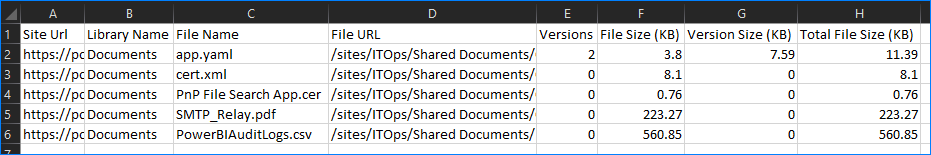

# Get SPO Library Size

PowerShell script to retrieve SPO library size including version history

## Requirements

* PnP.PowerShell module
* PowerShell 7.x
* User credential must be a Site Collection Admin on the target site

## Examples

### Get library size summary

```PowerShell
.\Get-SpoLibrarySize.ps1 -SiteUrl "HTTPS://site-url-here" -LibraryName "Library Name Here"
```

```Text
[PS] .\Get-SpoLibrarySize.ps1 -SiteUrl https://xxx.xxx.xxx/sites/xxx -LibraryName Documents

Site Url                    : https://xxx.xxx.xxx/sites/xxx
Library Name                : Documents
Total File Count            : 5
Total File Size (KB)        : 796.78
Total Version History Count : 2
Total Version Size (KB)     : 7.59
Total Library Size (KB)     : 804.37
```

### Get library size summary and output raw data to CSV

```PowerShell
.\Get-SpoLibrarySize.ps1 -SiteUrl "HTTPS://site-url-here" -LibraryName "Library Name Here" -RawDataCsv "CSV FILE PATH HERE"
```


